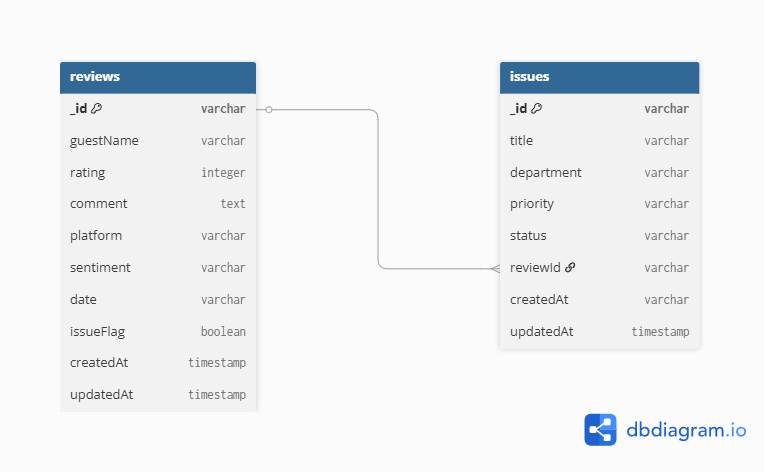

# Gevora Backend — Week 5

## Database Choice: MongoDB Atlas

We chose **MongoDB** over PostgreSQL because Gevora's data (guest reviews and issues) is naturally
document-based — fields like `sentiment` and `issueFlag` are derived dynamically per review, and the
schema is simple enough that a flexible NoSQL structure fits better than rigid relational tables.
Mongoose was used as the ODM to enforce schema validation on top of MongoDB's flexibility.

## Schema Diagram



**Entities:**
- **Review** — guest reviews with rating, sentiment, comment, platform, and an `issueFlag`
- **Issue** — operational tickets, optionally linked back to the review that triggered them via `reviewId`

**Relationship:** One `Review` → Zero or One `Issue` (`issues.reviewId` references `reviews._id`)

## Set Up the Database

1. Create a free MongoDB Atlas account at [mongodb.com/cloud/atlas](https://mongodb.com/cloud/atlas)
2. Create a free M0 cluster
3. Under **Database Access**, create a database user with a username/password
4. Under **Network Access**, allow access from anywhere (`0.0.0.0/0`) for development
5. Click **Connect** → **Drivers** → copy the Node.js connection string
6. Add it to `backend/.env`:
MONGO_URI=mongodb+srv://<username>:<password>@<cluster-url>/gevora?retryWrites=true&w=majority

## How to Run Backend Locally

1. Navigate to the backend folder
```bash
   cd gevora/backend
```
2. Install dependencies
```bash
   npm install
```
3. Set up environment variables
```bash
   cp .env.example .env
```
   Then fill in your own `MONGO_URI` (see above).
4. (Optional) Seed sample data
```bash
   node seed.js
```
5. Start the development server
```bash
   npm run dev
```
6. Server runs at `http://localhost:5000`

## API Endpoints

All endpoints now read from and write to MongoDB Atlas instead of in-memory arrays.

| Method | Endpoint | Description |
|--------|----------|-------------|
| GET | /api/health | Health check |
| GET | /api/reviews | Get all reviews |
| GET | /api/reviews/:id | Get single review |
| GET | /api/reviews/search?q= | Search reviews |
| POST | /api/reviews | Create review |
| PUT | /api/reviews/:id | Update review |
| DELETE | /api/reviews/:id | Delete review |
| GET | /api/issues | Get all issues |
| GET | /api/issues/:id | Get single issue |
| GET | /api/issues/search?status=&priority= | Filter issues |
| POST | /api/issues | Create issue |
| PUT | /api/issues/:id | Update issue |
| DELETE | /api/issues/:id | Delete issue |